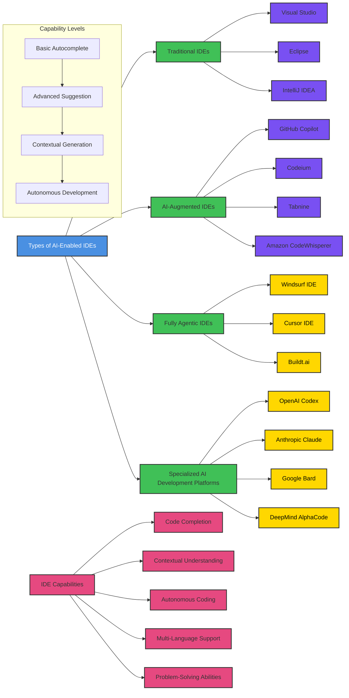

# AI-Enabled Agentic IDE Landscape

This flowchart provides a comprehensive overview of AI-powered Integrated Development Environments (IDEs) categorized by types and capabilities.

## IDE Types Explained

### 1. Traditional IDEs
- Basic development environment
- Manual coding
- Limited built-in intelligence
- Examples: Visual Studio, Eclipse, IntelliJ IDEA

### 2. AI-Augmented IDEs
- Intelligent code suggestions
- Partial automation
- Context-aware recommendations
- Examples: GitHub Copilot, Codeium, Tabnine

### 3. Fully Agentic IDEs
- End-to-end autonomous development
- Complete task understanding
- Proactive problem-solving
- Examples: Windsurf IDE, Cursor IDE, Buildt.ai

### 4. Specialized AI Development Platforms
- Advanced language models
- Research-oriented solutions
- Experimental AI capabilities
- Examples: OpenAI Codex, Anthropic Claude

## Key Capabilities

### 1. Code Completion
- Basic autocomplete
- Advanced contextual suggestions
- Intelligent code generation

### 2. Contextual Understanding
- Comprehend project structure
- Understand developer intent
- Provide relevant recommendations

### 3. Autonomous Coding
- Generate complete functions
- Create entire code modules
- Solve complex programming challenges

### 4. Multi-Language Support
- Versatility across programming languages
- Consistent performance
- Adaptive learning

### 5. Problem-Solving Abilities
- Analyze code issues
- Suggest optimizations
- Provide alternative implementations

## Capability Evolution
1. Basic Autocomplete
2. Advanced Suggestion
3. Contextual Generation
4. Autonomous Development

## Market Trends
- Increasing AI autonomy
- Natural language interfaces
- Reduced development friction
- Enhanced productivity tools

## Future Outlook
- More intelligent code generation
- Better developer intent understanding
- Cross-platform compatibility
- Ethical AI development practices
