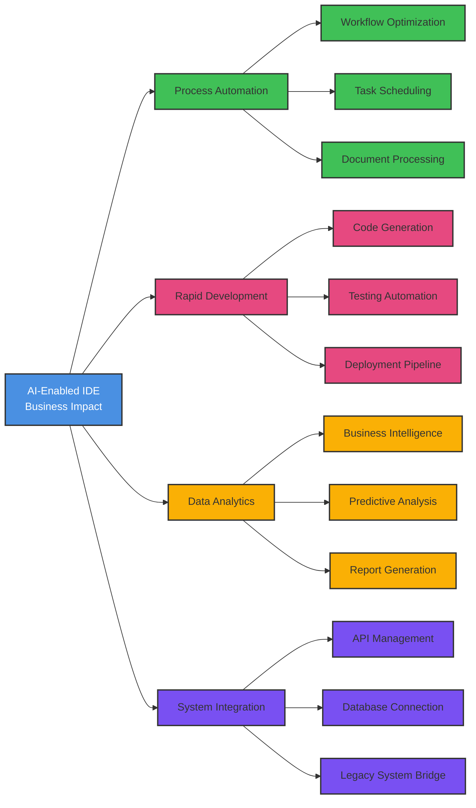

# AI-Enabled IDE Business Impact Areas

This flowchart illustrates the key areas where AI-enabled IDE can transform business operations.

## Area Descriptions

### Process Automation
- Streamlines repetitive tasks
- Reduces manual intervention
- Improves operational efficiency

### Rapid Development
- Accelerates code creation
- Ensures quality through automated testing
- Simplifies deployment processes

### Data Analytics
- Transforms raw data into insights
- Enables data-driven decisions
- Automates reporting workflows

### System Integration
- Connects disparate systems
- Manages API ecosystems
- Modernizes legacy infrastructure

## Benefits
- Reduced Development Time
- Improved Code Quality
- Enhanced Productivity
- Lower Operating Costs
- Faster Time-to-Market
- Better Resource Utilization
