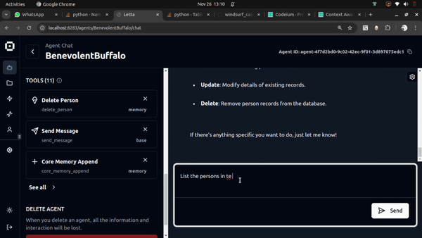

# Letta Agents to CRUD on Local SQLite Database

## Project Details

This project implements Letta Agents which has tools to interact with a local SQLite database and do CRUD operations. Letta is a Python framework that provides a declarative approach to building agents, enabling complex interactions between agents and systems.

### Motivation

AI has become the "lever" of 2024, and it can be seen as the "elephants" of 2024. Steering the AI is one of the major challenges we have to master in coming days.

When the Agents can create other Agents with least effort, then we have a game changer. With help of instructions and examples provided in english, if we can build a custom agent, and write the system prompt to make the agent come alive and connect it to LLM in 2 to 3 hrs in the first time!!! Its really a game changer.

The 2 to 3 hrs the 1st time will not just show the power of the Windsurf Cascades, but also show the variety of logical pitfalls that we will encounter when using different packages out in the open.

I wanted to use Windsurf Cascades to experiment with Letta Agents and see if it could be used to build a custom agent that could interact with a local SQLite database.

Well see for yourself. The CRUD operation performed on the SQL database through Natuaral language.



### Key Components

1. **Agent Communication**
   - Custom SQLMemory that extends ChatMemory from Letta framework
   - Custom methods for interacting with SQLite database through Letta agent

2. **Framework Integration**
   - Seamless integration with existing Letta Agents
   - Extension points for custom agent behaviors
   - Standardized communication patterns

### Project Structure

```
letta_agents_grpc/
├── instruction.md                # Project documentation
├── requirements.txt             # Project dependencies
├── person.py                    # Database model definition
|── task_queue_system_prompt.txt  # System prompt to use as example
|── sqlcrud_system_prompt.txt  # Reference system prompt
└── create_sql_memory_agent.py    # Code to create SqlMemory agent
```

### Setup Instructions

1. **Environment Setup**
   ```bash
   # Create and activate virtual environment
   python -m venv sqlcrud_venv
   source sqlcrud_venv/bin/activate

   # Install dependencies
   pip install -r requirements.txt
   ```

2. **Database Setup**
   ```bash
   # The SQLite database will be created with person.py script. 
   # Script uses sqlmodel to create person table with id, name, and email columns
   # The script will be a module that will be used by create_sql_memory_agent.py
   ```

3. **SqlMemory Coding**
   - `SqlMemory` class extends `ChatMemory` from Letta framework
   - `SqlMemory` class provides methods for CRUD operations on the database
   - `SqlMemory` class uses `sqlmodel` to interact with the database, and each method establishes a connection to the database

4. **Creating the Letta Agent**
   - Use the create_sql_memory_agent.py that does the following:
   - Create a Letta agent called `sqlcrud_agent`
   - Set the system prompt
   - Set the memory
   - Set the embedding config
   - Set the llm config
   - It also creates the database and provides the path to the database
    uses the person.py script to create the database


### Configuration Requirements

1a. **Groq API Setup**
   - Sign up for a Groq account at https://groq.com
   - Get your API key
   - Set the environment variable:
     ```bash
     export GROQ_API_KEY='your-api-key'
     ```
1b. **Openai API Setup**
   - Sign up for a Groq account at https://platform.openai.com.
   - Get your API key
   - Set the environment variable:
     ```bash
     export OPENAI_API_KEY='your-api-key'
     ```

2. **Letta ServerConfiguration**
   - Letta server runs on port 8283 (http://localhost:8283)
   - Connect to the letta server on the browser 

### Database Configuration

1. **Database Location**
   - The SQLite database is created at:
     ```
     /media/uberdev/ddrv/gitFolders/windsurf_cascades/letta_agents_sqlcrud/person.db
     ```
   - The database is automatically created when running create_sql_memory_agent.py

2. **SQLite URL Format**
   - The project uses absolute paths for database connections
   - SQLite URL format: `sqlite:////absolute/path/to/database.db` (note the 4 forward slashes)
   - Example:
     ```python
     engine = create_engine("sqlite:////media/uberdev/ddrv/gitFolders/windsurf_cascades/letta_agents_sqlcrud/person.db")
     ```

3. **Database Operations**
   - All CRUD operations use the same database path
   - Each operation establishes its own database connection
   - The database is created automatically if it doesn't exist

### Troubleshooting

1. **Database Issues**
   - If you encounter database errors, delete the `person.db` file and restart the gRPC server
   - The database will be recreated automatically
   - Ensure the database path is correct, in the tool

3. **Agent Issues**
   - Verify your Groq API or OPENAI_API_KEY key is properly set
   - Ensure the system prompt file exists and is readable
   - Ensure the Agent is populated on the letta server

### Running the Project

1. Open three terminal windows
2. Start the Letta server using the nohup command
3. Create the agent with create_sql_memory_agent.py
4. Connect to letta server via browser and interact with the agent

The application provides a chat interface where you can:
- Create new person records
- Query existing records
- Delete records
- List all records

All operations are performed through natural language interactions with the agent.


### Development Guidelines

#### Example Code to connect with Letta Server:

```python
from letta import create_client, LLMConfig, EmbeddingConfig
from letta.schemas.memory import ChatMemory

client = create_client()

# Using the groq_models, need to configure groq api keys
tool_llm = LLMConfig(
    model="llama3-groq-8b-8192-tool-use-preview",
    model_endpoint_type='groq',
    model_endpoint='https://api.groq.com/openai/v1',
    model_wrapper=None,
    context_window=8192,
    put_inner_thoughts_in_kwargs=True
)

hf_embed = EmbeddingConfig(
    embedding_model="letta-free",
    embedding_endpoint_type="hugging-face",
    embedding_dim=1024,
    embedding_chunk_size=300,
    embedding_endpoint="https://embeddings.memgpt.ai"
)

memory = ChatMemory(
    human="user",
    persona="assistant"
)

agent_state = client.create_agent(
    name="db_agent",
    system=open("grpc_dbcrud_system_prompt.txt", "r").read(),
    memory=memory,
    embedding_config=hf_embed,
    llm_config=tool_llm
)
```

#### Example Code to connect with Letta Server

```python
from letta import create_client, LLMConfig, EmbeddingConfig
from letta.schemas.memory import ChatMemory

client = create_client()

# Using the groq_models, need to configure groq api keys
# refer to the process here https://docs.letta.com/models/groq
# to use groq models use below config
tool_llm = LLMConfig(model="llama3-groq-8b-8192-tool-use-preview", model_endpoint_type='groq', model_endpoint='https://api.groq.com/openai/v1', model_wrapper=None, context_window=8192, put_inner_thoughts_in_kwargs=True)

hf_embed = EmbeddingConfig(embedding_model="letta-free", embedding_endpoint_type="hugging-face", embedding_dim=1024, embedding_chunk_size=300, embedding_endpoint="https://embeddings.memgpt.ai")
# to use openai models use below config
from letta import LLMConfig, EmbeddingConfig

# llm_config specification
llm_config = LLMConfig(
    model="gpt-4o-mini",
    model_endpoint_type="openai",
    model_endpoint="https://api.openai.com/v1",
    context_window=128000
)
 
# embedding model specification
embedding_config = EmbeddingConfig(
    embedding_endpoint_type="openai",
    embedding_endpoint="https://api.openai.com/v1",
    embedding_model="text-embedding-ada-002",
    embedding_dim=1536,
    embedding_chunk_size=300
)
# rest are configs are common

memory_blocks = ChatMemory(
    human="Call me Superman",
    persona="I am a super Intelligent being"
)

# Agent Instances is created in Python
# In the Letta Server, the Agent will be created

tooluser_state = client.create_agent(
    name="tooluser",
    system=open("data/main_system_prompt.txt", "r").read(),
    memory=memory_blocks,
    embedding_config=hf_embed,
    llm_config=tool_llm
)

# Sending message to the Agent, and getting response
response = client.send_message(
    agent_id=tagentstate.id,
    role="user",
    message="Add 'get me a contact of POTUS' and 'call me TaskMaster'",
)

response
```

#### Example code to create a custom ChatMemory based on the Letta's ChatMemory
https://docs.letta.com/advanced/custom_memory

Below is an example of how to create a custom ChatMemory, where the task queue is stored in core memory, and the agent can push and pop tasks from the queue.

```python
from letta.memory import ChatMemory, MemoryModule
from typing import Optional, List

class TaskMemory(ChatMemory): 

    def __init__(self, human: str, persona: str, tasks: List[str]): 
        super().__init__(human=human, persona=persona) 
        self.memory["tasks"] = MemoryModule(limit=2000, value=tasks) # create an empty list 


    
    def task_queue_push(self, task_description: str) -> Optional[str]:
        """
        Push to a task queue stored in core memory. 

        Args:
            task_description (str): A description of the next task you must accomplish. 
            
        Returns:
            Optional[str]: None is always returned as this function does not produce a response.
        """
        self.memory["tasks"].value.append(task_description)
        return None

    def task_queue_pop(self) -> Optional[str]:
        """
        Get the next task from the task queue 
 
        Returns:
            Optional[str]: The description of the task popped from the queue, 
            if there are still tasks in queue. Otherwise, returns None (the 
            task queue is empty)
        """
        if len(self.memory["tasks"].value) == 0: 
            return None
        task = self.memory["tasks"].value[0]
        self.memory["tasks"].value = self.memory["tasks"].value[1:]
        return task

task_agent_state = client.create_agent(
    name="task_agent", 
    memory=TaskMemory(
        human="My name is Sarah", 
        persona="You have an additional section of core memory called `tasks`. " \
        + "This section of memory contains of list of tasks you must do." \
        + "Use the `task_queue_push` tool to write down tasks so you don't forget to do them." \
        + "If there are tasks in the task queue, you should call `task_queue_pop` to retrieve and remove them. " \
        + "Keep calling `task_queue_pop` until there are no more tasks in the queue. " \
        + "Do *not* call `send_message` until you have completed all tasks in your queue. " \
        + "If you call `task_queue_pop`, you must always do what the popped task specifies", 
        tasks=["start calling yourself Bob", "tell me a haiku with my name"], 
    )
)

```
ChatMemory implementation for reference

```python
from memgpt.memory import BaseMemory

class ChatMemory(BaseMemory):

    def __init__(self, persona: str, human: str, limit: int = 2000):
        self.memory = {
            "persona": MemoryModule(name="persona", value=persona, limit=limit),
            "human": MemoryModule(name="human", value=human, limit=limit),
        }

    def core_memory_append(self, name: str, content: str) -> Optional[str]:
        """
        Append to the contents of core memory.

        Args:
            name (str): Section of the memory to be edited (persona or human).
            content (str): Content to write to the memory. All unicode (including emojis) are supported.

        Returns:
            Optional[str]: None is always returned as this function does not produce a response.
        """
        self.memory[name].value += "\n" + content
        return None

    def core_memory_replace(self, name: str, old_content: str, new_content: str) -> Optional[str]:
        """
        Replace the contents of core memory. To delete memories, use an empty string for new_content.

        Args:
            name (str): Section of the memory to be edited (persona or human).
            old_content (str): String to replace. Must be an exact match.
            new_content (str): Content to write to the memory. All unicode (including emojis) are supported.

        Returns:
            Optional[str]: None is always returned as this function does not produce a response.
        """
        self.memory[name].value = self.memory[name].value.replace(old_content, new_content)
        return None
